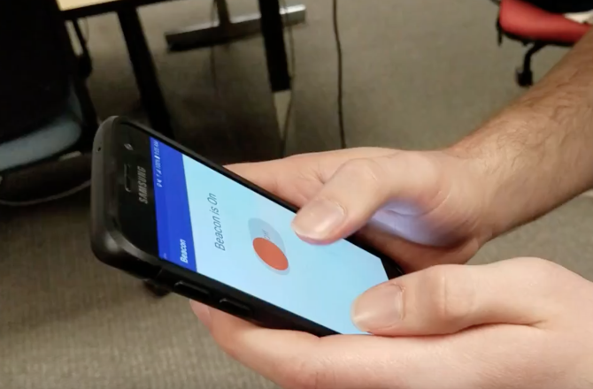

# Beacon: location detection app for 911 operations

911’s archaic infrastructure, originally designed to handle calls from landlines, has hard time receiving consistently accurate location data. Often times, cell phone calls to 911 do not share accurate location data or even have location data. Studies have estimated that improving 911's location detection could save upwards of 10,000 lives per year. 

Our app, called Beacon, requires a simple installation and one-step activation system and then simply runs in the background of your phone, waiting for you to dial 911. Once it detects that you’ve attempted an emergency call, it activates your location services which allows us to quickly and easily transmit your location data to the 911 call center through our servers. 

